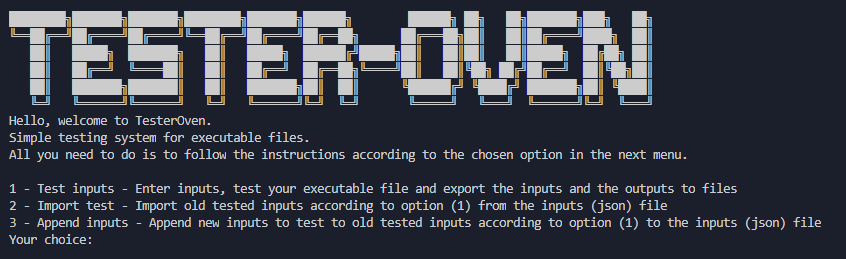

# TesterOven Project

TesterOven Project is a simple tester that allows you to test your executable files with inputs.
All you need to do is to enter inputs according to the options in the menu, they will direct you.
Hope you will found it usefull, have fun tho.

## Menu list

* 1 - Test inputs - Enter inputs, test your executable file and export the inputs and the outputs to files
* 2 - Import test - Import old tested inputs according to option (1) from the inputs (json) file
* 3 - Append inputs - Append new inputs to test to old tested inputs according to option (1) to the inputs (json) file

Menu image:  


## Usage (Windows)

Python must be installed

```
python TesterOven.py
....
```
## License
[MIT](https://choosealicense.com/licenses/mit/)

## Etc.
4fun project which made in 4 hours :)
